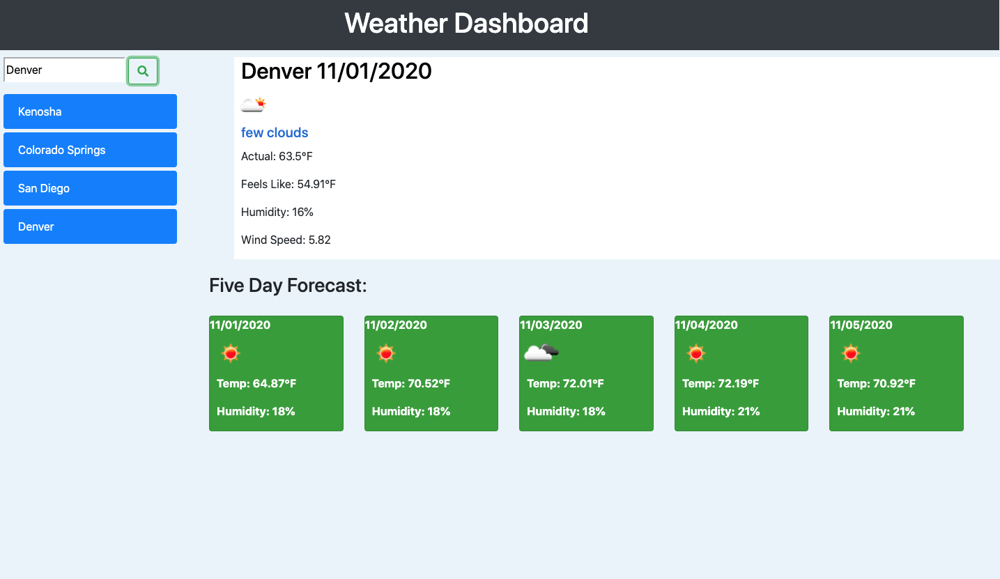

# Project Objective

Link: https://speloqu24.github.io/Weather_Dash/

The main objective of this project was to demonstrate a successful call to an API that would help display current and forecasted weather.

# API Call with AJax

My first approach to this project included Fetch, at that point I hadn't seen much of AJAX. Our instructor introduce AJax to us briefly in class but really dug into it during a review session we had. At that point I realized that to me AJAX makes more sense and gets to the point quicker (less code). The structure is straight forward. Thats when I changed my approach from FETCH to AJAX.

# Dynamic HTML/JQuery

It may have taken a few tries to really get started creating HTML elements dynamically through JQuery, but once I got going I really started to understand the possibilities of of dynamic creation. The logic is a perfect map to the HTML structure.

# Template Literals

This was fun. It was another insight into how to shorten code and approach by combining JQUERY and Template literals to create elements. This is probably my new favorite part of coding.

# Screenshot

